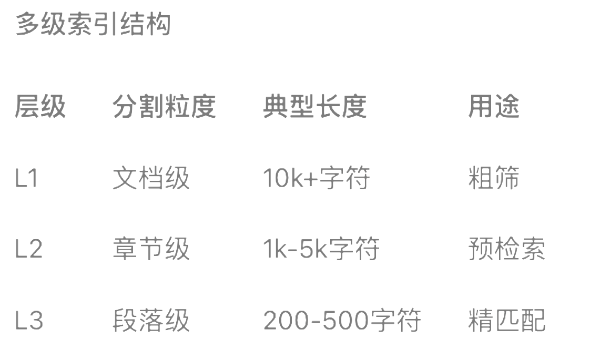

# LangChain-RAG Study Notes

RAG solution using LangChain

## High level flow of RAG:

1. Receive an input query
2. Use the retrieval system to search for relevant information based on the query
3. Incorporate the retrieved information into the prompt sent to the LLM
4. Generate a response that leverages the retrieved context

## RAG Data Pipeline Flow

1. Documents are pushed or pulled into a data pipeline (e.g LangChain support loading documents in various formats pdf, text, docx)
2. Each document is broken down into chunks (Text splitter)

## What chunking methods should I use for the data/questions?

- **Length-based**:
  - Token-based: Splits text based on the number of tokens, which is useful when working with language models
  - Character-based: Splits text based on number of characters, which can be more consistent across different types of text (CharacterTextSplitter)
- **Text-Structured based**:
  - Splits text based on the structures such as paragraph, sentences, words (RecursiveCharacterTextSplitter)
- **Document-structure based**:
  - This chunking method is used for structured document such as **HTML**, **Markdown** and **JSON**

```
from langchain_community.document_loaders import UnstructuredMarkdownLoader
from langchain.text_splitter import MarkdownHeaderTextSplitter
# 加载 Markdown 文档
loader = UnstructuredMarkdownLoader("example.md")
documents = loader.load()
# 使用 MarkdownHeaderTextSplitter 分割
splitter = MarkdownHeaderTextSplitter(headers_to_split_on=["#", "##", "###"])
chunks = splitter.split_text(documents[0].page_content)
# 打印分割结果 for chunk in chunks:
print(chunk)
```

- **Semantic-based splitting**: This method considers the content of the text by directly analyzing the semantics of the text. The core methods relies on NLP models, using sentence embeddings (Setence-BERT) to compute semantic boundaries and detect split points through abrupt changes in text similarity.

## Embedding

Embedding models are at the core of many retrieval systems. These models transform human language into a format that machines can understand and compare quickly and accurately. They take text as input and generate a fixed-length numerical array. Embeddings enable search systems to retrieve relevant documents not only through keyword matching, but also through semantic understanding (e.g RAG)

- Reference: https://python.langchain.com/docs/concepts/embedding_models/

Key concepts:

1. Embed text as a veector: Embeddings transform text into a numerical vector representation
2. Measure similarity: Embedding vectors can be compared using simple mathematical operations

LangChain provides a unified interface for interacting with embedding models and offers standardardized methods for common operations. This general interface simplifies interactions with various embedding providers through two core methods:

- embed_documents
- embed_query

```python
from langchain_openai import OpenAIEmbeddings
# 初始化 OpenAI 嵌入模型
embeddings = OpenAIEmbeddings(model="text-embedding-ada-002")
# 这里取第一个片段进行embedding，省token
document_embeddings = embeddings.embed_documents(chunks[0].page_content)
print("文档嵌入：", document_embeddings[0])
# 文档嵌入： [0.0063153719529509544, -0.00667550228536129,...]
print(len(document_embeddings))
# 935
# 单个查询
query = "这篇文章介绍DeepSeek的什么版本"
# 使用 embed_query 嵌入单个查询
query_embedding = embeddings.embed_query(query)
print("查询嵌入：", query_embedding)
# 查询嵌入：[-0.0036168822553008795, 0.0056339893490076065,...]
```

### Vector Stores


A vector store stores embedded data and performs similarity search. LangChain supports a wide varity of embedding models and vector stores. For detailed information on the supported types, refer to [full list of langchain vectorstore integrations](https://python.langchain.com/docs/integrations/vectorstores/)

### Other Scenarios for Vector Embedding Technology

Vector Embedding and Storage go far beyond just Retrieval-Augmented Generation (RAG) systems - they have a wide range of applications across various domains. Some key use cases include:

1. Semantic Search Systems - Enabling search based on the meaning of content, not just keyword matches.
2. Recommendation System - Suggesting items based on similarity in content or user behavior
3. Documents Clustering - Automatically organizing and categorizing large volumes of documents.
4. Anomaly Detection - Identifying data points that deviate from normal patterns.
5. Multimodel Systems - Bridging contents across text, images, audio, and other modalities.
6. Content Deduplication - Detecting similar/duplicate content.
7. Knowledge Graph - Buiding semantic connections among entities.
8. Sentiment Analysis - Capturing emotional characteristics of text

While RAG is a significant use case for vector embedding technology, its value extends much further - providing a foundation for any AI system that needs to understand semantic relationships within content.

## Retrievers

The Retrievers in LangChain is a runnable type, which provides a unified way to interact with different type of retriver systems, including vectorstores, graph databases and relational databases, for example

```
docs = retriever.invoke(query)
```

In LangChain, the search_type of `as_retriever()` method determines the retriever methods:

```python
retriever = vector_store.as_retriever(
    search_type="similarity", # 可选 "similarity"|"mmr"|"similarity_score_threshold"
    search_kwargs={
         "k": 5, # 返回结果数量
         "score_threshold": 0.7, # 仅当search_type="similarity_score_threshold"时有效
         "filter": {"source": "重要文档.pdf"}, # 元数据过滤
         "lambda_mult": 0.25 # 仅MMR搜索有效(控制多样性)
         }
    )
search_kwargs： 搜索条件
search_type可选 "similarity"|"mmr"|"similarity_score_threshold"
```

- **similarity**

  - (default) Return directly the top k documents most similar to the query vector (based on cosine similarity or L2 distance)
  - Results are strictly ranked by similarity
  - Well-suited for scenarios requiring precise matching

- **MMR** (Maximal Marginal Relevance)

  - **Principle**: Add diversity control on top of simularity, helping avoid returning redundant results
  - **Core Parameter**: `lambda_mult` in the range of (0,1) where 1 favors similarity (like standard similarity search) and 0 favors diversity
  - Useful when retrieval results need to cover different subtopics
  - Helps prevent returning overly similar or redundant documents

- **similarity_score_threshold** (Similarity Search with a Score Cutoff)
  - Only returns documents with similarity scores above a specified threshold.
  - score_threshold: Similarity threshold (typically in the range of 0 to 1 for cosine similarity)
  - k: Maximum number of documents to return (actual number may be fewer than k)
  - Ideal for **quality-first scenarios**
  - The nunber of results is not fixed (can return zero or more depending on threshold)

| Type                       |         Core Objective          | Result Count | Diversity Control | Typical Use Case               |
| -------------------------- | :-----------------------------: | -----------: | ----------------: | ------------------------------ |
| similarity                 |        Precise Matching         |    Fixed `k` |                ❌ | Factual question answering     |
| mmr                        | Balance relevance and diversity |     Fixed`k` |                ✅ | Generate comprehansive reports |
| similarity_score_threshold |        Quality filtering        |      Dynamic |                ❌ | High-precision filtering       |

## Advanced Retriever Tools

### MultipleQueryRetriever - Improve Recall for Fuzzy Queries

Design Goal: Enhance retrieval quality through query expansion.

Core idea:

- Generate multiple related queries from the user's original input (e.g., paraphrasing, sub-question decomposition)
- Merge and deduplicate results from all generated queries
- Improve recall for fuzzy or vague queries
- Relies on LLMs to generate high-quality expanded queries (requires careful management of generation costs)

### MultiVectorRetriever

Design Goal: Handle multiple vectors for a single document

Core Idea:

- Generate multiple sets of embedding vectors for the same document (e.g., full-tex vector, summary vector, keyword vector, etc.)
- Improve recall by capturing the document from multiple perspectivs
- Well-suited for documents with complex structures (e.g., technical papers with text, figures, and code)
- **Higher storage cost** due to maintaining multiple vector sets per document

## RetrievalQA

Design Goal: Build an end-to-end Question Answering (QA) system

Core Idea:

- Pipeline the retriever with an LLM-baesd answer generation module
- Supports multiple chain types, such as:
  - **stuff** - feed all retrieved documents into the LLM at once
  - **map_reduce** - generate intermediate answers and combine them
  - **refine** - iteratively improve the answer using retrieved docs
    This approach allows for flexible and scalable QA systems construction that can adapt to different ues cases and resource constraints

```python
# 构建一个高性能问答系统 from langchain.chains import RetrievalQA
from langchain.retrievers.multi_query import MultiQueryRetriever
from langchain.retrievers.multi_vector import MultiVectorRetriever
# 1. 多向量存储 # 假设已生成不同视角的向量
vectorstore = FAISS.from_texts(documents, embeddings)
mv_retriever = MultiVectorRetriever(
    vectorstore=vectorstore,
    docstore=standard_docstore, # 存储原始文档 id_key="doc_id" # 关联不同向量与原始文档
    )
# 2. 多查询扩展
mq_retriever = MultiQueryRetriever.from_llm(
    retriever=mv_retriever,
    llm=ChatOpenAI(temperature=0.3)
    )
# 3. 问答链
qa = RetrievalQA.from_chain_type(
    llm=ChatOpenAI(temperature=0),
    chain_type="refine",
    retriever=mq_retriever,
    chain_type_kwargs={"verbose": True}
    )
# 执行
answer = qa.run("请对比Transformer和CNN的优缺点")
```

## TimeWeightedVectorStoreRetriever - 时间加权检索

Design Goal: Introduce a temporal decay factor into vector retrieval to prioritize more recent documents

Core Idea:

- Adjust similarity scores with a time-based weight, so that newer documents are ranked higher even if they have slightly lower semantic similarity
  Typical Use Cases:
- News/Social Media Platforms - Prioritize the latest articles or posts over older ones.
- Technical Document Systems - Recommend the most recent versions of APIs or tools
- Real-time Monitoring & Alerts - Ensure recent alert/events are surfaced with higher priority.
  This approach is particularly effective in time-sensitive environments, where freshness of information is critical

## Hybrid Retrieval

### EnsembleRetriever - 集合检索器

Scenarios

- Combines semantic search (e.g., using vector similarity) with keyword-based search (e.g., tranditional lexical search).
- Purposes: Leverages the strengths of both approaches:
  - Keyword search: precise for exact terms
  - Semantic search: useful for conceptual similarity
- Typical Scenairo: Improves retrieval robustness in complex QA systems or enterprise search engines.

### `ContextualCompressionRetriever` - Context-Aware Compression

- Use Case: Filter low-relevance or noisy chunks after initial retrieval.
- How it works: Applies an LLM to compress or refine the set of retrieved documents based on their contextual relevance to the query.
- Typical Secnario:
  - Post-processing step to enhance the signal-to-noise ratio
  - Useful when initial retrieval yields too much irrelevant content (e.g., in long-form documents or noisy datasets)
    These retrievers are especially useful when combining recall and precision, ensureing not just finding content but finding the right content.

**Notes**

- **Recall** - a metric used to evaluate the effectiveness of information retrieval systems, classification models, and search algorithms - especially in context like semantic search, recommendation systems, and machine learning.
- Recall measures the ability of a system to find all relevant items from a dataset.

```
Recall = (Number of Relevant Items Retrieved) / (Total Number of Relevant Items)
```

- 📊 How It's Measured (Example):

Imagine you have a system that’s supposed to retrieve all documents relevant to a user's query. There are 10 relevant documents in total. If the system retrieves 7 of those, then:

```
Recall = 7 / 10 = 0.7 (or 70%)
```

✅ High Recall Means:

- The system returns most or all relevant documents
- It prioritizes not missing anything important
- However, it may also return irrelevant items (i.e., low precision)

⚖️ Recall vs. Precision:

- Recall: "How many of the relevant items did we find?"
- Precision: "How many of the retrieved items were actually relevant?"

In many systems (like search or recommendation), there's a trade-off:

- High recall may bring more noise
- High precision may miss some relevant content

## About Enterprise RAG
The content above serves as the foundational knowledge of RAG, but if you want to build an enterprise-leveal RAG system - especially something like a Product Information Assistant, it is far from sufficient to build the Q&A style interactions based on a knowledge base. While the overall flow remains the same, each component requires its own specialized handling. In real-world usage, the implentation needs to be dailored to fit specific business documents, user cases, and accuracy requirements.

上面的内容是作为RAG的基础知识，但是想做企业级别的RAG,尤其是要做 产品资讯助手 这种基于知识库和用户进行问答式的交流还远远不够。总流程没有区别，但是每一块都有自己特殊处理地方：
我通过读取一些企业级RAG的文章，大致整理一下这种流程，但是真实使用时候，还是需要根据我们自己业务文档，使用的场景和对于回答准确率要求的情况来酌情处理。
4.1 文本加载和文本清洗
企业级知识库构建在 预处理 这部分的处理是重头戏。因为我们文档是多样性的，有不同类型文件，文件里面还有图片，图片里面内容有时候也是需要识别的。另外文档基本都是产品或者运营来写，里面有很多口头语的表述，过多不合适的分段/语气词，多余的空格，这些问题都会影响最后分割的效果。一般文本清洗需要做一下几步：
•去除杂音：去掉文本中的无关信息或者噪声，比如多余的空格、HTML 标签和特殊符号等。
•标准化格式：将文本转换为统一的格式，如将所有字符转为小写，或者统一日期、数字的表示。
•处理标点符号和分词：处理或移除不必要的标点符号，并对文本进行适当的分词处理。
•去除停用词：移除那些对语义没有特别贡献的常用词汇，例如“的”、“在”、“而”等。
•拼写纠错：纠正文本中的拼写错误，以确保文本的准确性和一致性。
•词干提取和词形还原：将词语简化为词干或者词根形式，以减少词汇的多样性并保持语义的一致性。
4.2 文本分割
除了采取上面的基本分割方式，然后还可以结合层次分割优化不同粒度的索引结构，提高检索匹配度。
补充一下多级索引结构：

from langchain.text_splitter import MarkdownHeaderTextSplitter headers = [ ("#", "Header 1"), ("##", "Header 2"), ("###", "Header 3") ] splitter = MarkdownHeaderTextSplitter(headers_to_split_on=headers) chunks = splitter.split_text(markdown_doc)
4.3 向量存储
在企业级存储一般数据量都很大，用内存缓存是不现实的，基本都是需要存在数据库中。至于用什么数据库，怎么存也根据文本类型有变化，例如：
•向量数据库：向量存储库非常适合存储文本、图像、音频等非结构化数据，并根据语义相似性搜索数据。
•图数据库：图数据库以节点和边的形式存储数据。它适用于存储结构化数据，如表格、文档等，并使用数据之间的关系搜索数据。
4.4 向量检索
在很多情况下，用户的问题可能以口语化形式呈现，语义模糊，或包含过多无关内容。将这些模糊的问题进行向量化后，召回的内容可能无法准确反映用户的真实意图。此外，召回的内容对用户提问的措辞也非常敏感，不同的提问方式可能导致不同的检索结果。因此，如果计算能力和响应时间允许，可以先利用LLM对用户的原始提问进行改写和扩展，然后再进行相关内容的召回。
4.5 内容缓存
在一些特定场景中，对于用户的问答检索需要做缓存处理，以提高响应速度。可以以用户id，时间顺序，信息权重作为标识进行存储。
还有一些关于将检索信息和prompt结合时候，如何处理等其他流程


from langchain.text_splitter import MarkdownHeaderTextSplitter headers = [ ("#", "Header 1"), ("##", "Header 2"), ("###", "Header 3") ] splitter = MarkdownHeaderTextSplitter(headers_to_split_on=headers) chunks = splitter.split_text(markdown_doc)
4.3 向量存储
在企业级存储一般数据量都很大，用内存缓存是不现实的，基本都是需要存在数据库中。至于用什么数据库，怎么存也根据文本类型有变化，例如：
•向量数据库：向量存储库非常适合存储文本、图像、音频等非结构化数据，并根据语义相似性搜索数据。
•图数据库：图数据库以节点和边的形式存储数据。它适用于存储结构化数据，如表格、文档等，并使用数据之间的关系搜索数据。
4.4 向量检索
在很多情况下，用户的问题可能以口语化形式呈现，语义模糊，或包含过多无关内容。将这些模糊的问题进行向量化后，召回的内容可能无法准确反映用户的真实意图。此外，召回的内容对用户提问的措辞也非常敏感，不同的提问方式可能导致不同的检索结果。因此，如果计算能力和响应时间允许，可以先利用LLM对用户的原始提问进行改写和扩展，然后再进行相关内容的召回。
4.5 内容缓存
在一些特定场景中，对于用户的问答检索需要做缓存处理，以提高响应速度。可以以用户id，时间顺序，信息权重作为标识进行存储。
还有一些关于将检索信息和prompt结合时候，如何处理等其他流程，这里不多讲，讲多了头疼。。。
总结
本文介绍了RAG的基础过程，在langchain框架下如何使用，再到提供两个个例子进行了代码实践，最后又简要介绍了企业级别RAG构建的内容。最后希望大家能有所收获。